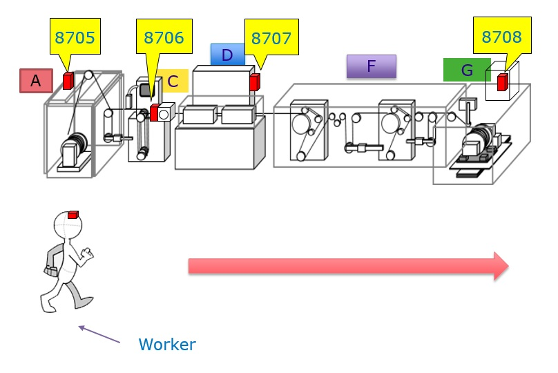

# Work-pattern-modelling
observation of work pattern using unsupervised machine learning
This project aims to visualize the work pattern of several workers working on different machines in a factory
The data consists of 56 workers working on three machines for 28 days.
The data is collected at every 1 minute.
In this project Principal component analysis has been used followed by K-means clustering.
The figure shows the different positions around the machine. The beacons are placed on the machines. The worker is wearing a sensor and beacon recieves the signal from the sensor and detects the position of worker.
The position data of worker has een collected for different machine states (run, stop, planned stop etc).
This position data has been analyzed to predict work pattern.
To run this project clone or download the files and store in the working directory. Never forget to change the address of the files in the code.
coding for principal component analysis has been done both in matlab and python. The file 'pca_analysis.m' is the matlab code for pca analysis and clustering. It needs Machine learning toolbox to run. 
athe excel file 'machine 5.xlsx' is just a glimpse of data. original data is too big to be uploaded.

